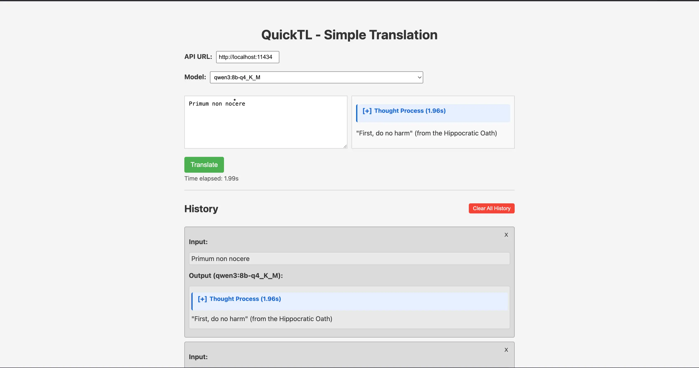

# quickTL

A two-file solution for all your translation needs, powered by Ollama!

## Usage

Assuming you already have [Ollama](https://github.com/ollama/ollama) set up and running, using this 'app' is simple:

1. Clone the repository: `git clone https://github.com/lumitry/quickTL`
2. Open the html file in your browser of choice
3. Type in your Ollama API base URL (or stick with the default of `http://localhost:11434` if you're using the default port on the same machine you're already on)
4. Select the model you'd like to use in the dropdown
5. Enter the text you'd like to translate
6. Use `cmd`/`ctrl` + `enter` to submit the text, or click the Translate button.
7. Watch the response stream in!

While generating, you can optionally stop the stream by clicking the Stop button, which seems to cancel the request on Ollama's end as well.

Once it's done, the translation will appear in the history section below the output box. You can remove individual items from the history, or clear it all at once.

## Features

- Translation history
- API URL, model, and history are all stored in local storage

## To Do

- [ ] Refactor for cleaner code
- [ ] make the styling less "web 1.0"-y
  - [/] add breakpoints for mobile/browser sidebar width so that the title doesn't take up three lines
  - [ ] dark mode
  - [x] make the whitespace added by marked.js smaller
- [ ] Add a button to copy the translation to the clipboard (both in output and history)
- [ ] File persistence
- [ ] Vision?? Might be simple if it's just turning the image into base64
- [ ] Language selection (right now, the model has to figure that out on its own)
- [ ] Add a button to clear the text area
- [x] Add images to the README
  - [ ] Put the image in a CDN so that it doesn't have to be downloaded every time someone clones the project
- [ ] maybe also a ~~gif~~ webm?
- [ ] Customizable prompt (perhaps with presets)
- [ ] A settings panel, if that's possible without overcomplicating things
  - [ ] Model parameters
- [ ] Show errors in the UI instead of just console logging them
- [ ] fix `Unchecked runtime.lastError: A listener indicated an asynchronous response by returning true, but the message channel closed before a response was received` and the other weird errors I get on occassion
- [ ] Test trying to break it intentionally (changing API url then model then going back to the original URL: what happens there? et cetera)
  - Note: I don't consider jailbreaks to be a bug. It's obviously extremely easy to get this to output arbitrary HTML. I might add some sanitzation to the outputs later, but it's not a priority right now.

## Philosophy

(What this is and what it isn't)

This isn't meant to be a chatbot, just a translation tool. Previous translations aren't passed as context.

This is meant to be a simple tool that uses the bare minimum amount of Javascript I can get away with. I don't hate frameworks or anything, but it's so nice to avoid using tooling entirely. Everything works super quickly, and no data is sent to some opaque server in the cloud somewhere.

I'm using Ollama as the backend because it's far simpler than any alternatives for local AI, and the goal of this project is simplicity. I don't plan on adding other generation backends any time soon unless they can be integrated neatly.

I'm considering putting the JS back into the HTML file and going with a one-file solution, but I think it's nice to have the HTML and JS separate. It makes it easier to read and understand what's going on. It also prevents a 500+ line HTML file, which is nice.

## Dependencies

Not really a dependency per se, but this project uses [Marked.js](https://marked.js.org) to render markdown. Changing that should be fairly simple if you want to—for example, you could use a prompt that asks for an HTML response and just render that instead (sounds dangerous, though Marked assumes trusted inputs as well), or you could write a simple parser yourself, or just use a prompt asking for a plain text response.

## Reflection

I didn't think streamed responses would work in vanilla JS like this. Really cool stuff IMO.
